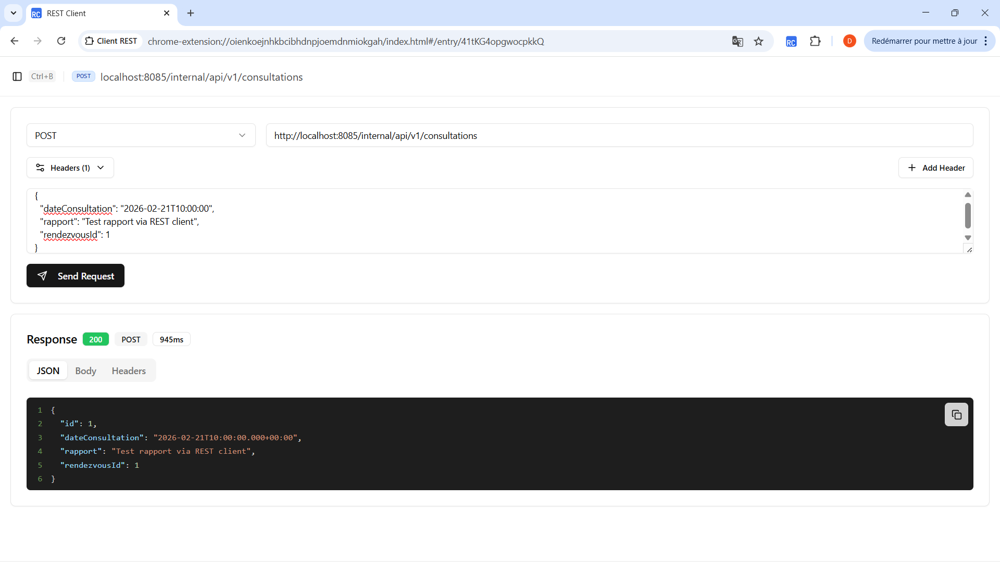
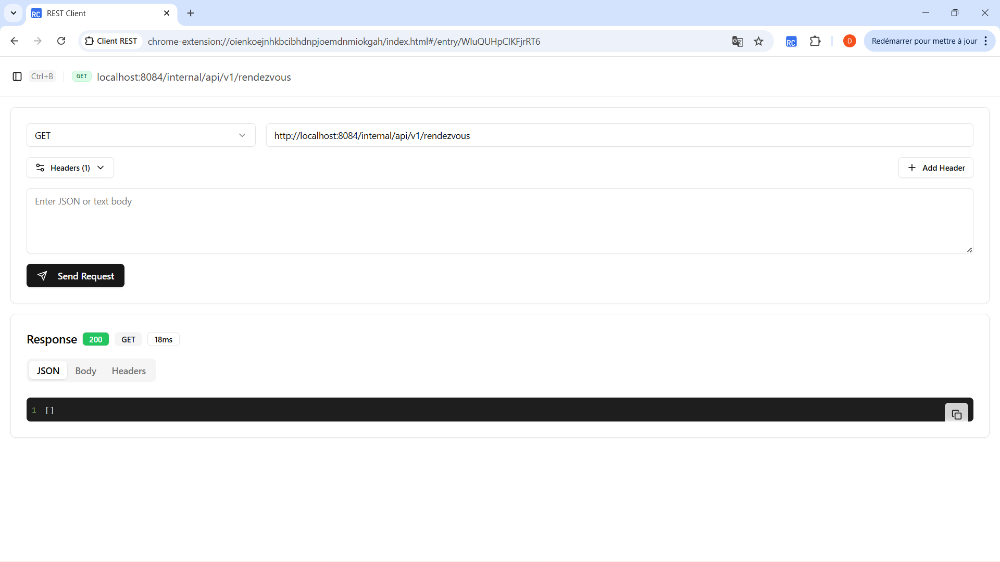
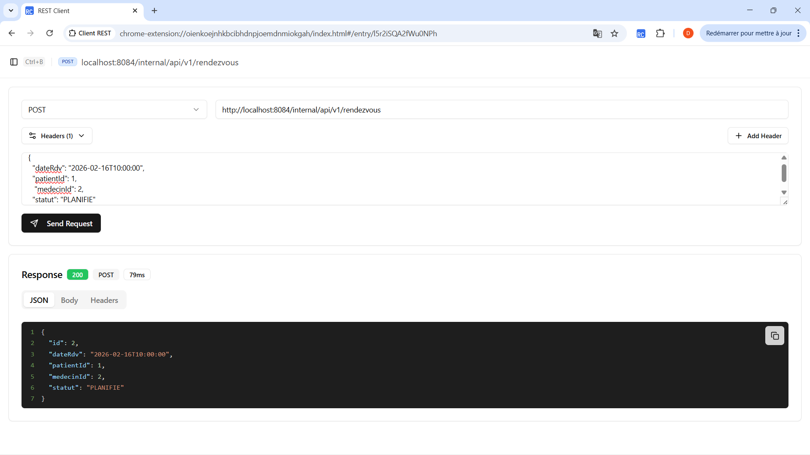
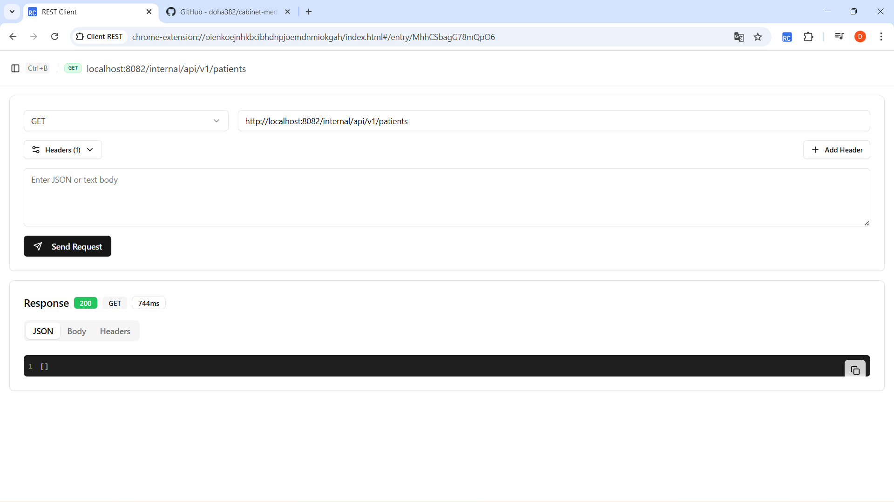
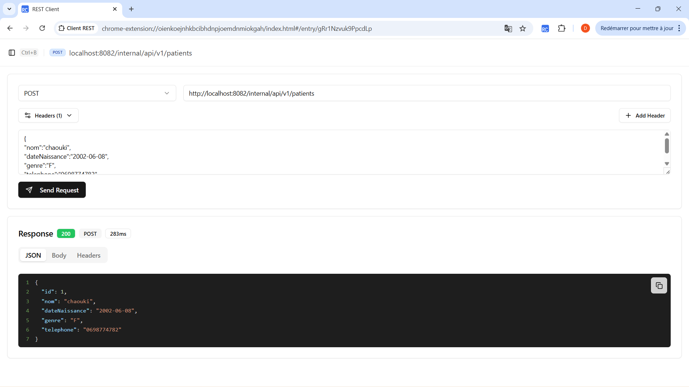
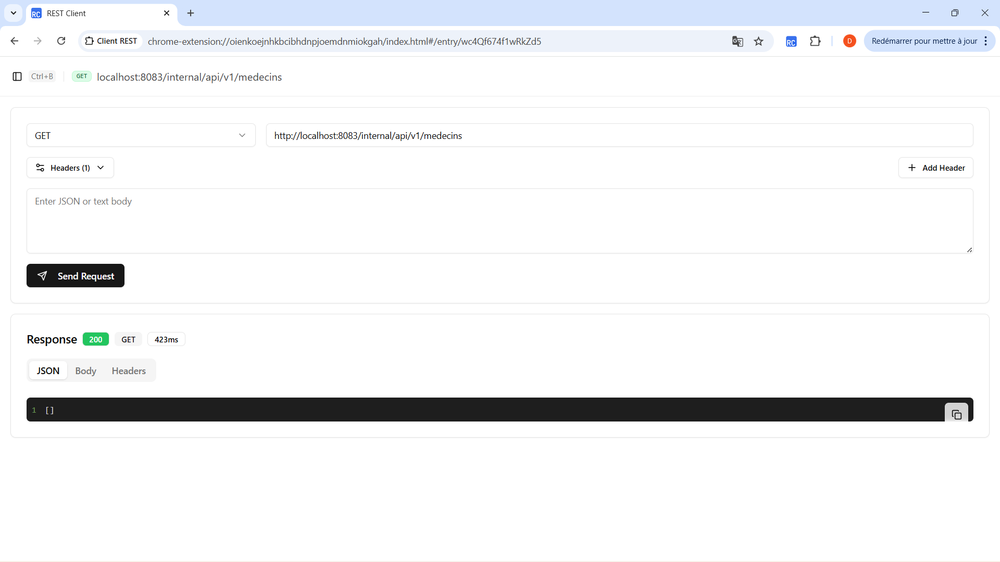
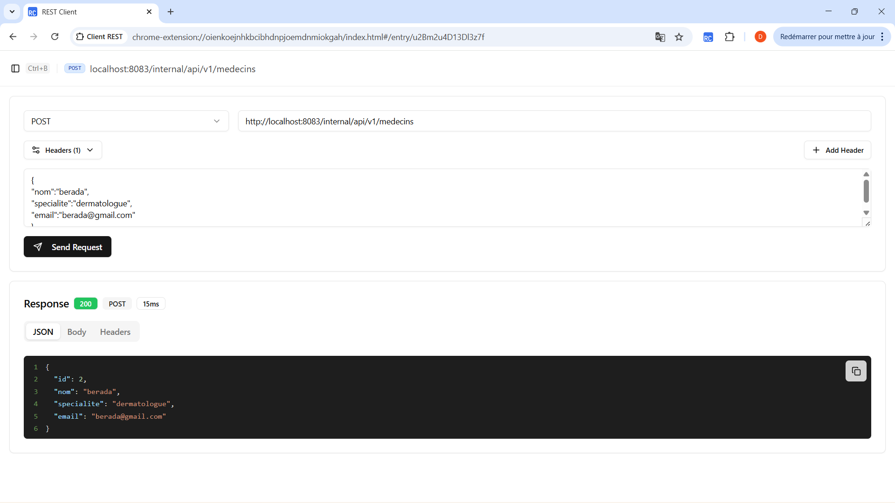

# 🩺 Gestion d’un Cabinet Médical – Architecture Microservices (TP3)

Ce projet représente la **troisième phase** de l'évolution du système de gestion de cabinet médical. Nous sommes passés d'une architecture SOA monolithique à une **architecture microservices REST** totalement découplée.

---

## 🚀 Objectifs du TP
* **Découplage total** : Chaque service possède sa propre logique et sa propre base de données.
* **API Gateway** : Mise en place d'un point d'entrée unique via Spring Cloud Gateway.
* **Communication REST** : Échanges inter-services via `RestTemplate`.
* **Persistance isolée** : Utilisation d'une base de données H2 dédiée par microservice.

---

## 🏗️ Architecture Globale

L'architecture est composée de microservices métiers et d'un service d'agrégation, tous accessibles derrière une passerelle.


### Structure du projet
* `api-gateway` : Point d'entrée unique (**Port 8080**).
* `patient-service` : Gestion des patients (**Port 8082**).
* `medecin-service` : Gestion des médecins (**Port 8083**).
* `rendezvous-service` : Gestion des rendez-vous (**Port 8084**).
* `consultation-service` : Gestion des consultations (**Port 8085**).
* `dossier-service` : Service composite pour l'agrégation des données.

---

## 🛠️ Stack Technique
* **Langage** : Java 21 (OpenJDK Temurin)
* **Framework** : Spring Boot 3.1 & Spring Cloud
* **Accès aux données** : Spring Data JPA
* **Base de données** : H2 Database (In-Memory)
* **Build Tool** : Maven 3.9
* **Outils** : Lombok, IntelliJ IDEA, REST Client

---

## 📡 Endpoints de Test

### 1️⃣ Consultation Service
* **GET** `http://localhost:8085/internal/api/v1/consultations`
* **POST** `http://localhost:8085/internal/api/v1/consultations`

### 2️⃣ Rendez-vous Service
* **GET** `http://localhost:8084/internal/api/v1/rendezvous`
* **POST** `http://localhost:8084/internal/api/v1/rendezvous`

### 3️⃣ Patient Service
* **GET** `http://localhost:8082/internal/api/v1/patients`
* **POST** `http://localhost:8082/internal/api/v1/patients`

### 4️⃣ Médecin Service
* **GET** `http://localhost:8083/internal/api/v1/medecins`
* **POST** `http://localhost:8083/internal/api/v1/medecins`

---

## 📸 Aperçu des tests

| Service | Liste des données (GET) | Création (POST) |
| :--- | :--- | :--- |
| **Consultation** |  |  |
| **Rendez-vous** |  |  |
| **Patient** |  |  |
| **Médecin** |  |  |

---

## ⚙️ Installation et Lancement

1.  **Compiler le projet parent** :
    ```bash
    mvn clean install
    ```
2.  **Lancer les microservices** :
    Démarrer chaque service via IntelliJ ou en ligne de commande :
    ```bash
    mvn spring-boot:run
    ```
3.  **Accès Gateway** :
    Toutes les APIs sont accessibles via le port `8080` de l'API Gateway.

